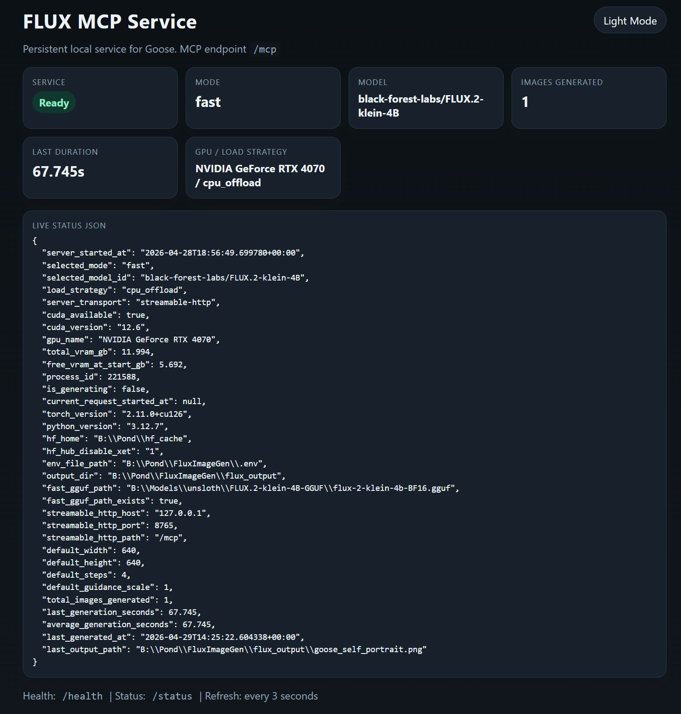

# FluxImageGenMCP

Local Windows MCP server for FLUX image generation with a persistent Goose-ready service, a small monitoring dashboard, and multiple model modes including a GGUF-backed fast path.

## What This Repo Gives You

- Persistent MCP service over `streamable-http` for Goose
- One-command Windows launchers for `fast`, `low`, and `high` modes
- Local dashboard for health, status, logs, and request activity
- VRAM-aware defaults for smaller GPUs
- Optional GGUF-backed `fast` mode using a local FLUX.2 Klein transformer file

## Screenshots

Dashboard in dark mode:



Sample output generated through the service:


Additional curated screenshots can continue to live in `docs/screenshots/`.

## Architecture

This project centers on [`mcp_flux_server.py`](./mcp_flux_server.py), which exposes:

- `generate_image`
- `flux_status`

It supports two transports:

- `stdio` for one-off local/manual use
- `streamable-http` for persistent service mode

Persistent service mode also exposes:

- `/` dashboard
- `/health`
- `/status`
- `/mcp` MCP endpoint

## Modes

| Mode | Model | Intended use | Typical defaults on 12 GB GPU |
|---|---|---|---|
| `fast` | `FLUX.2-klein-4B` with local GGUF transformer | quickest practical workflow | `640x640`, `4` steps, `1.0` guidance |
| `low` | `FLUX.2-klein-base-4B` | better quality than fast, slower | `704x704`, `16` steps, `1.5` guidance |
| `high` | `FLUX.2-dev` | highest quality, slowest | `768x768`, `40` steps, `3.5` guidance |

### Fast mode

`fast` mode expects this local GGUF by default:

- `B:\Models\unsloth\FLUX.2-klein-4B-GGUF\flux-2-klein-4b-BF16.gguf`

You can override that path in either of these ways:

- create a local `.env` file from [`.env.example`](./.env.example)
- use the dashboard settings panel to save a new `FLUX_FAST_GGUF_PATH`

After changing the GGUF path, restart the service.

Notes:

- The GGUF file only covers the transformer weights.
- The rest of the pipeline still loads through Diffusers.
- On the current 12 GB RTX 4070 test machine, `fast` mode still falls back to CPU offload, but it is materially lighter than the old base-model workflow.

## Quick Start

### 1. Create a venv

```powershell
py -3.12 -m venv flux-env312
.\flux-env312\Scripts\Activate.ps1
```

### 2. Install dependencies

```powershell
python -m pip install --upgrade pip
python -m pip install -r requirements.txt
```

If PyTorch ends up CPU-only, reinstall it using the CUDA wheel source from [`requirements.txt`](./requirements.txt).

### 2.5. Optional local config

If your GGUF file is not at the default path, copy [`.env.example`](./.env.example) to `.env` and set:

```powershell
FLUX_FAST_GGUF_PATH=C:\Your\Models\flux-2-klein-4b-BF16.gguf
```

### 3. Start the service

Recommended:

```powershell
.\start_flux_fast.bat
```

Other options:

```powershell
.\start_flux_low.bat
.\start_flux_high.bat
.\start_flux_menu.bat
```

PowerShell equivalents:

```powershell
.\start_flux_service.ps1 -Mode fast
.\start_flux_service.ps1 -Mode low
.\start_flux_service.ps1 -Mode high
```

### 4. Service URLs

- Dashboard: `http://127.0.0.1:8765/`
- Health: `http://127.0.0.1:8765/health`
- Status JSON: `http://127.0.0.1:8765/status`
- MCP endpoint for Goose: `http://127.0.0.1:8765/mcp`

The dashboard also includes a settings panel for updating the `fast` mode GGUF path. Changes are written to your local `.env` file and apply after restart.

## Goose Setup

Use a remote MCP extension instead of the old `stdio` flow.

1. Run `goose configure`
2. Choose `Add Extension`
3. Choose `Remote Extension (Streamable HTTP)`
4. Name it something like `flux-fast`
5. Set endpoint to `http://127.0.0.1:8765/mcp`
6. Set timeout to `3600`
7. Disable any older local `stdio` FLUX extension

Important:

- Goose can still override width and height explicitly.
- The server defaults only apply when Goose does not send those values.

## Service Operations

Start:

```powershell
.\start_flux_service.ps1 -Mode fast
```

Stop:

```powershell
.\stop_flux_service.ps1 -Port 8765
```

Status:

```powershell
.\status_flux_service.ps1 -Port 8765
```

Live log tail:

```powershell
.\monitor_flux_service.ps1 -Port 8765
```

The service scripts:

- prevent duplicate healthy instances on the same port
- refuse to start if the port is already occupied by something else
- write per-port metadata and logs under `.flux-service/`
- wait until the model is loaded before reporting success

## Environment Variables

Defaults:

- `HF_HOME=B:\Pond\hf_cache`
- `HF_HUB_DISABLE_XET=1`
- `FLUX_LOAD_STRATEGY=auto`

Low-mode overrides:

- `FLUX_LOW_MODEL_ID`
- `FLUX_LOW_WIDTH`
- `FLUX_LOW_HEIGHT`
- `FLUX_LOW_STEPS`
- `FLUX_LOW_GUIDANCE_SCALE`

Fast-mode overrides:

- `FLUX_FAST_MODEL_ID`
- `FLUX_FAST_GGUF_PATH`
- `FLUX_FAST_GGUF_CONFIG_REPO`
- `FLUX_FAST_WIDTH`
- `FLUX_FAST_HEIGHT`
- `FLUX_FAST_STEPS`
- `FLUX_FAST_GUIDANCE_SCALE`

## Legacy Launchers

Manual foreground `stdio` launchers are kept for debugging only:

- `start_flux_low_stdio_legacy.bat`
- `start_flux_high_stdio_legacy.bat`

Do not run them alongside the persistent Goose service.

## Project Layout

| Path | Purpose |
|---|---|
| [`mcp_flux_server.py`](./mcp_flux_server.py) | main MCP server |
| [`.env.example`](./.env.example) | local config template for per-machine settings |
| [`start_flux_service.ps1`](./start_flux_service.ps1) | persistent service launcher |
| [`status_flux_service.ps1`](./status_flux_service.ps1) | service status summary |
| [`monitor_flux_service.ps1`](./monitor_flux_service.ps1) | live log tail |
| [`example_mcp_config.json`](./example_mcp_config.json) | example MCP configuration |
| [`MEMORY.md`](./MEMORY.md) | running project memory / operating notes |

## Current Limitations

- `fast` mode is lighter, but it still does not fully avoid offload on the current 12 GB RTX 4070 test machine.
- `high` mode is much slower and may require a large first-time download.
- In the currently installed Diffusers build, `negative_prompt` is not exposed in `high` mode.

## Notes

- CUDA is required for intended performance.
- Output images are written to `flux_output/`.
- Output filenames are sanitized for Windows.
- Requests are serialized so the shared pipeline is not used concurrently.
- Logging goes to `stderr` so MCP stdio clients are not corrupted.
